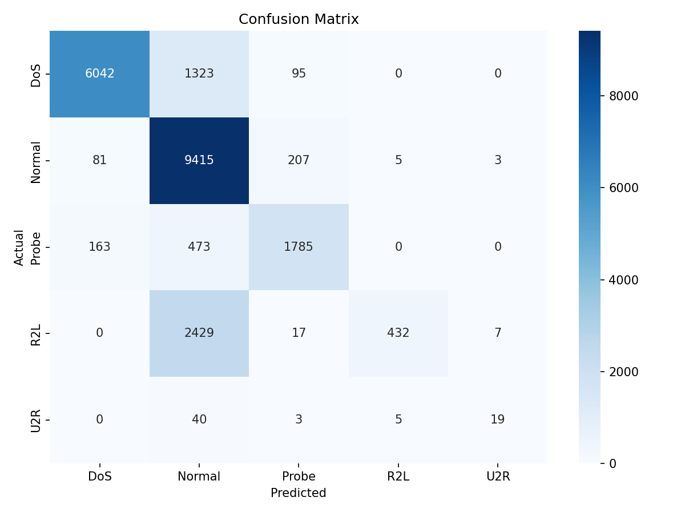

# Assignment Report Example

---

**Course:** Advanced Python (ICS0019)

**Team members:** Marten Pitsner, Henrik Julius Tarand

**Date:** 24.05.2026

Repository link: [GitHub, GitLab or other **public** online repository]

---

## 1. Approach

### 1.1 Strategy Overview

Plan was to begin with the starter pipeline to establish a baseline model, and then improve the macro F1 by focusing
on the rare attack classes. We used methods to improve R2L and U2R detection rather than only overall accuracy because
the dataset is imbalanced.

### 1.2 Preprocessing

- **Feature engineering:** We did not add custom engineered features.
- **Feature selection:** Removed level column and constant num_outbound_cmds column because they do not provide anything
useful.
- **Scaling:** [Did you apply StandardScaler, MinMaxScaler, or none?]

### 1.3 Class Imbalance Handling

- **Method used:** Used class_weight="balanced" in the random forest baseline and SMOTENC for the XGBoost.
- **Parameters:** 
- Random Forest: `class_weight="balanced"`
- SMOTENC: `categorical_features=[1,2,3]`, `random_state=42`
- XGBoost:
  - `n_estimators=300`
  - `max_depth=6`
  - `learning_rate=0.1`
  - `min_child_weight=5`
  - `subsample=1.0`
  - `colsample_bytree=1.0`
- **Effect on training set distribution**: Imbalance handling increased weight of minority classes during training. Lead
to improved minority-class recall and macro F1 without balancing.

---

## 2. Experiments

### Total number of experiments: 5

### Experiment 1: Tuned Random Forest

- **Algorithm:** Random Forest Classifier
- **What changed from baseline:** Added tuning using GridSearchCV with StratifiedKFold
cross-validation and enabled balanced class weight.
- **Macro F1 (CV):** 0.9421
- **Macro F1 (test):** 0.4973
- **Observation:** Model achieved a very high cross-validation score but performed significantly
worse on the test set, which indicates overfitting. Struggled with minority classes (R2L, U2R).

### Experiment 2: XGBoost

- **Algorithm:** XGBoost
- **What changed:** Replaced Random Forest with XGBoost.
- **Macro F1 (CV):** 0.9435
- **Macro F1 (test):** 0.5570
- **Observation:** Improved test macro F1 compared to tuned Random Forest.
Performed well on major classes, but still struggled with the minority ones.
Model still generalises poorly.

### Experiment 3: Tuned XGBoost

- **Algorithm:** XGBoost
- **What changed:** Added tuning using GridSearchCV with StratifiedKFold
- **Macro F1 (CV):** 0.9497
- **Macro F1 (test):** 0.5944
- **Observation:** Tuning improved macro F1 and minority performance got better,
especially U2R. But CV remains much higher than test score and model is not close
to being optimal yet.

### Experiments Summary

| # | Description | Algorithm | Imbalance Handling | Macro F1 (CV) | Macro F1 (test) |
|---|---|---|---|--------------:|----------------:|
| 1 | Tuned Random Forest with cross-validation | Random Forest | `class_weight="balanced"` |        0.9421 |          0.4973 |
| 2 | XGBoost baseline | XGBoost | none |        0.9435 |          0.5570 |
| 3 | Tuned XGBoost | XGBoost | none |        0.9497 |          0.5944 |
| 4 | SMOTENC + tuned XGBoost | XGBoost | `SMOTENC(categorical_features=[1, 2, 3], random_state=42)` |        0.9461 |          0.6256 |
| 5 | SVM baseline | SVM | `StandardScaler()` + `class_weight="balanced"` |        0.7053 |          0.5236 |

---

## 3. Final Results

### 3.1 Best Model

- **Algorithm:** XGBoost
- **Key parameters:** `n_estimators=300`, `max_depth=5`, `learning_rate=0.1`, `min_child_weight=1`, `subsample=1.0`, `colsample_bytree=0.8`, `gamma=0`
- **Imbalance handling:** `SMOTENC(categorical_features=[1, 2, 3], random_state=42)`
- **Feature engineering:** None

### 3.2 Final Macro F1-Score

| Metric | Score |
| --- | --- |
| Macro F1 (test) | 0.6256 |
| Macro F1 (CV) | 0.9461 |

### 3.3 Classification Report

| Category | Precision | Recall | F1-Score | Support |
|---|---:|---:|---:|---:|
| Normal | 0.69 | 0.97 | 0.81 | 9711 |
| DoS | 0.96 | 0.81 | 0.88 | 7460 |
| Probe | 0.85 | 0.74 | 0.79 | 2421 |
| R2L | 0.98 | 0.15 | 0.26 | 2885 |
| U2R | 0.66 | 0.28 | 0.40 | 67 |

### 3.4 Confusion Matrix

## 4. Cross-Validation vs. Test Score

- **CV macro F1:** 0.9461
- **Test macro F1:** 0.6256
- **Gap:** 0.3205

**Analysis:** CV score is much higher than final test score. It is expected because the dataset is imbalanced and rare
classes are hard to learn reliably. Gap suggests overfitting due to the training distribution, but using SMOTENC improves
minority-class detection.

---

## 5. What Worked and What Didn't

### What had the biggest positive impact?

Adding SMOTENC improved the score most (from 0.5944 to 0.6256), specifically the rare classes. For example, U2R F1
imrpoved from 0.35 to 0.40 and R2L F1 improved from 0.15 to 0.26.

### What surprisingly didn't help?

Further tuning of model byitself (besides SMOTENC) only modestly improved the score. CV scores were consistently much higher
than test scores, which showed that CV score didn't effectively reflect test performance.

### What would you try with more time?

Use additional balancing methods, such as other oversampling strategies, more feature engineering, or, alternatively, use
a model that is focused on minority-class recall.

---

## Appendix: Environment

- **Hardware:** Apple M3, 24 GB
- **Python version:** 3.13.7
- **Key libraries:** pandas, numpy, scikit-learn, xgboost, imbalanced-learn, matplotlib, seaborn
- **Random seed:** 42